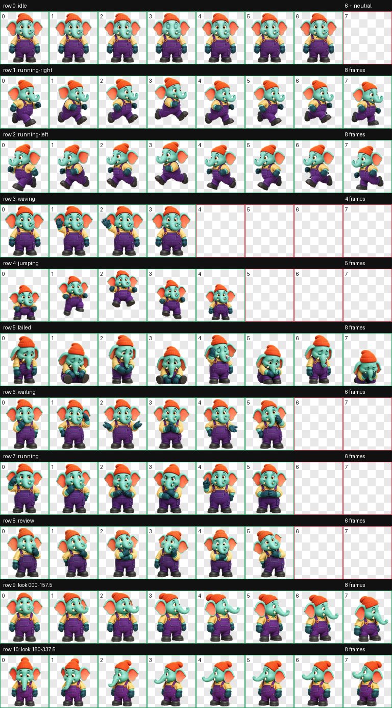

# Bytephant

Bytephant is a cheerful animated elephant pet for Codex. It uses the Codex pet v2 format with nine standard animation states and sixteen clockwise look directions.



## Install

1. Download `pet.json` and `spritesheet.webp`.
2. Create `~/.codex/pets/bytephant/`.
3. Copy both files into that folder.
4. Restart Codex if Bytephant does not appear immediately.

Expected layout:

```text
~/.codex/pets/bytephant/
├── pet.json
└── spritesheet.webp
```

## Pet format

- Sprite format: WebP with transparency
- Atlas: 8 columns × 11 rows
- Cell size: 192 × 208 pixels
- Sprite version: 2
- Animations: idle, run right, run left, wave, jump, failed, waiting, working, review, and 16 look directions

## License

Bytephant's artwork and package files are released under the Creative Commons Attribution 4.0 International license. See [LICENSE](LICENSE).

## Credits

Created by Emon Xu with Codex.

---

## 中文介绍

Bytephant 是一只为 Codex 制作的活泼小象宠物。它采用 Codex 宠物 v2 格式，包含九种标准动画状态，以及按顺时针方向排列的十六种观察方向。

## 安装方法

1. 下载 `pet.json` 和 `spritesheet.webp`。
2. 创建目录 `~/.codex/pets/bytephant/`。
3. 将这两个文件复制到该目录中。
4. 如果 Bytephant 没有立即出现，请重新启动 Codex。

安装后的目录结构应为：

```text
~/.codex/pets/bytephant/
├── pet.json
└── spritesheet.webp
```

## 宠物格式

- 精灵图格式：支持透明背景的 WebP
- 图集布局：8 列 × 11 行
- 单格尺寸：192 × 208 像素
- 精灵图版本：2
- 动画：待机、向右奔跑、向左奔跑、挥手、跳跃、失败、等待、工作、检查，以及 16 个观察方向

## 许可证

Bytephant 的美术素材和宠物包文件采用知识共享署名 4.0 国际许可证（CC BY 4.0）发布，详情请参阅 [LICENSE](LICENSE)。

## 作者

由 Emon Xu 与 Codex 共同创作。
